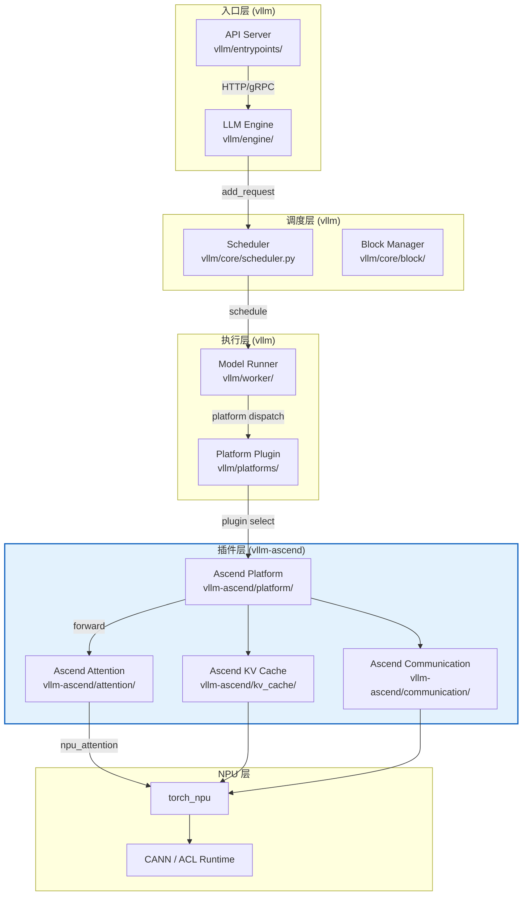
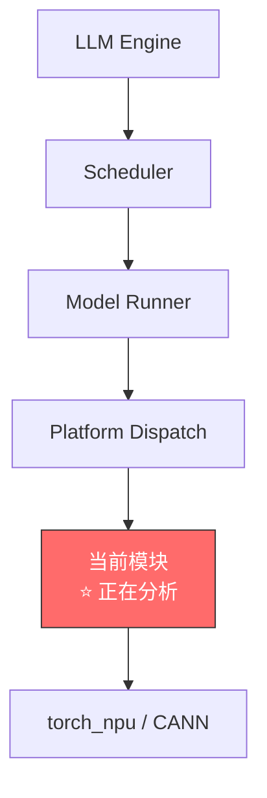
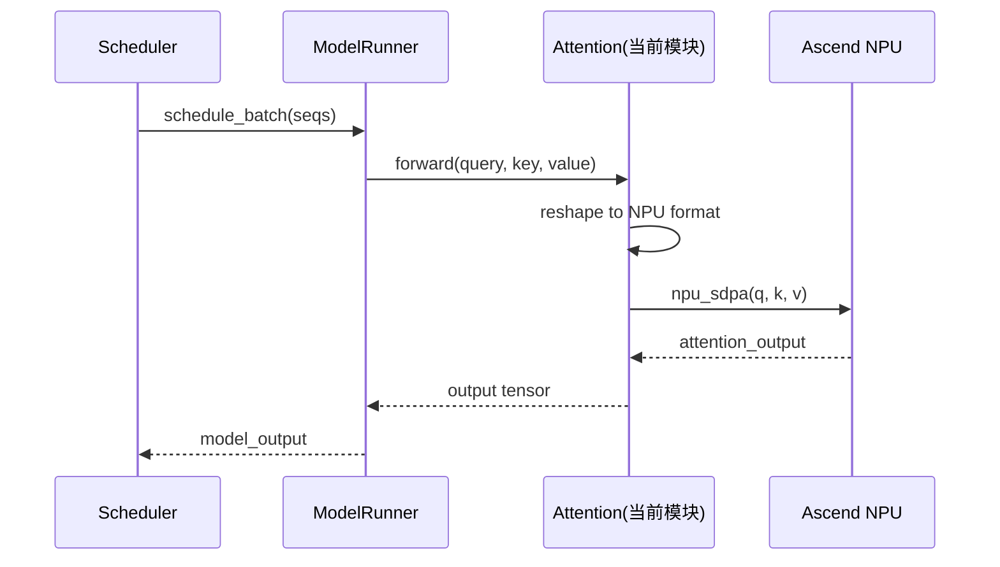
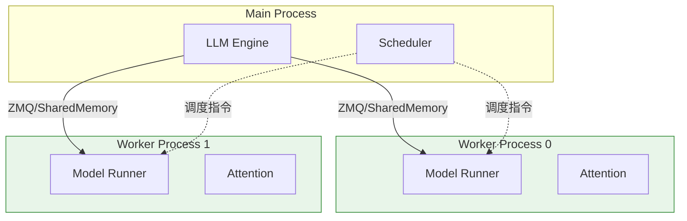
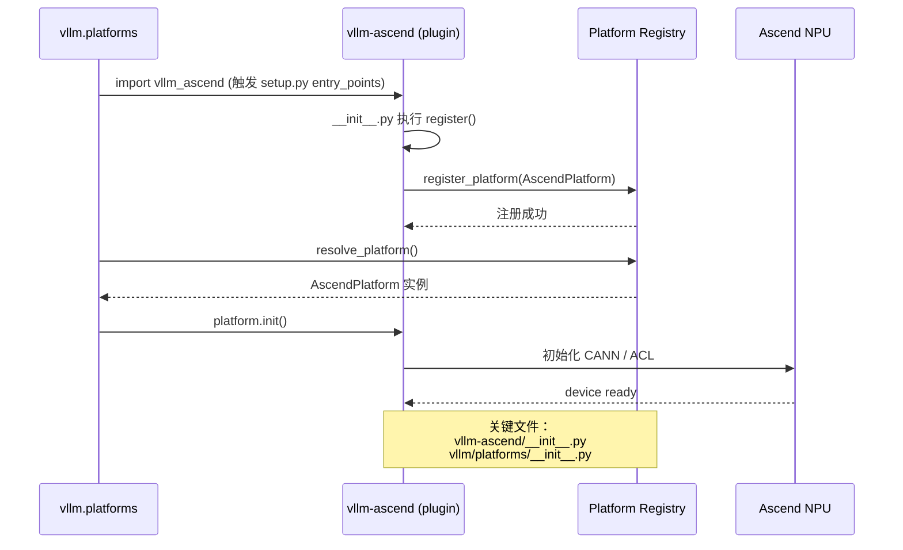
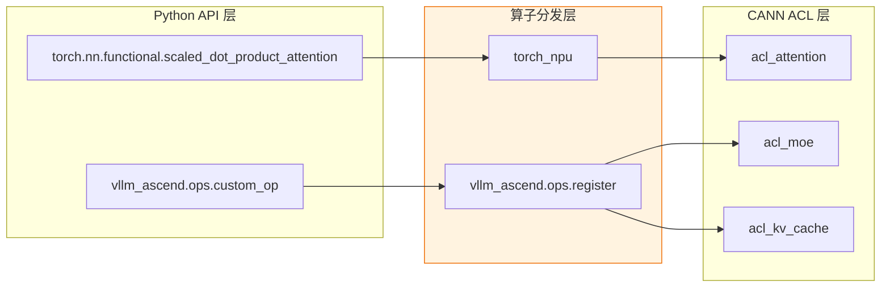
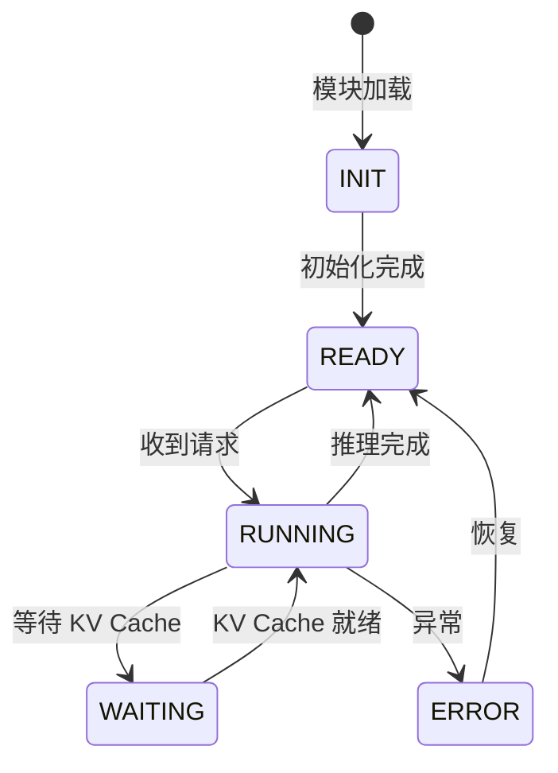
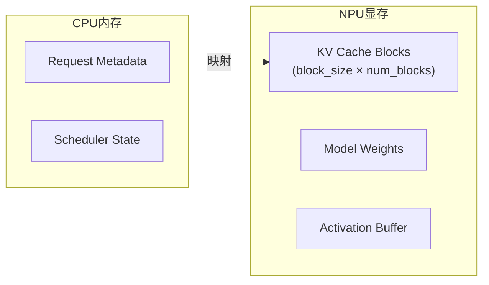

# vLLM / vllm-ascend 代码模块分析 Skill

针对 vLLM 及 vllm-ascend 仓库的功能模块进行深度分析，输出结构化的 Markdown 文档，优先使用 Mermaid 图可视化表达。分析框架保持通用，也可用于其他 Python/C++ 项目。

---

## 触发词

详细分析、模块分析、分析代码、代码分析、分析一下这个模块、详细分析一下、深入分析、深度分析、分析一下

---

## 输入

| 输入 | 必需 | 说明 |
|------|------|------|
| 目标仓库路径 | 必需 | 如 `vllm/`、`vllm-ascend/`、或其他项目路径 |
| 功能模块名/路径 | 必需 | 如 `attention/`、`kv_transfer/`、`scheduler.py` |
| 分析深度 | 可选 | 默认 `standard`；可选 `deep`（含进程/线程模型、算子映射等） |
| 补充关注点 | 可选 | 用户特别关注的方面，如"只看数据流"、"关注锁竞争" |

> **本工作区默认路径**：vLLM 上游 `vllm/`，Ascend 插件 `vllm-ascend/`。分析时可相对引用。

---

## 输出

| 产出 | 格式 | 说明 |
|------|------|------|
| 模块分析文档 | .md 文件 | 含概述、文件清单、调用链、Mermaid 图、深度分析 |

输出位置（按优先级）：
1. 工作区根目录的 `docs/analysis/{module_name}-analysis.md`
2. 或 `{目标仓库路径}/docs/analysis/{module_name}-analysis.md`

---

## Mermaid 图兼容性规范（CRITICAL）

VSCode Markdown 预览内置的 Mermaid 版本较旧（通常 < 8.6.0），以下特性 **禁止使用**，否则渲染必然失败：

### ❌ 禁用特性

| 禁用项 | 原因 | 替代方案 |
|--------|------|----------|
| `dateFormat X`（Unix 时间戳） | VSCode Mermaid < 8.6.0 不支持 | 用 `dateFormat YYYY-MM-DD HH:mm:ss` + 绝对时间 |
| `axisFormat %s` | 部分旧版不支持 | 用 `axisFormat %H:%M:%S` |
| `x y` 坐标简写（甘特图） | 解析器回退到 0 | 写完整 `:id, after xxx, duration` |
| Mermaid mindmap | 部分版本不支持 | 用 flowchart 替代 |

### ✅ 甘特图正确写法

**错误写法**（VSCode 中所有条都从 0 开始）：

```mermaid
gantt
    dateFormat X
    axisFormat %s
    section 阶段
    任务1 :done, 0, 15
    任务2 :done, 15, 35
```


**正确写法**（兼容 VSCode）：
```mermaid
gantt
    dateFormat YYYY-MM-DD HH:mm:ss
    axisFormat %H:%M:%S
    section 阶段
    任务1 :done, 2026-01-01 00:00:00, 15s
    任务2 :done, after 任务1, 20s
    任务3 :active, 2026-01-01 00:00:35, 10s
```

### ✅ 甘特图写法规则

1. **绝对日期格式**: `dateFormat YYYY-MM-DD HH:mm:ss` — 永不出错
2. **时长用 `Xs` 后缀**: `15s`（秒）、`5m`（分钟）、`1h`（小时），不用裸数字
3. **依赖用 `after xxx`**: 链路清晰，不依赖数字解析
4. **起始时间固定**: 第一个任务用 `2026-01-01 00:00:00`（或其他固定时间），后续用 `after`
5. **axisFormat 用时间格式**: `%H:%M:%S` 或 `%M:%S`，不用 `%s`

### ✅ 其他图的兼容性建议

- **flowchart**: 全兼容，放心用（`graph TB` / `graph LR` 均可）
- **sequenceDiagram**: 全兼容
- **classDiagram**: 部分版本不支持 `<<interface>>` 语法，用注释代替
- **stateDiagram-v2**: VSCode 内置版可能不支持，优先用 flowchart 复现状态机
- **pie**: 兼容
- **erDiagram**: 部分不支持，可用表格替代

---

## 分析流程

### 第〇阶段：模块分类识别（必做）

在深入分析之前，先判断模块属于哪种类型，以便选择合适的分析维度：

| 模块类型 | 典型特征 | vllm/vllm-ascend 示例 | 推荐分析维度 |
|----------|----------|----------------------|-------------|
| **算子类** | 包含 CUDA/NPU kernel 调用，`torch_npu` / `cuda_` 前缀 | `attention/`, `fused_moe/`, `activation/` | 数据流 → 算子映射 → 性能关键路径 |
| **通信类** | 涉及跨卡/跨节点数据传输，`HCCL` / `NCCL` / `gloo` | `kv_transfer/`, `context_parallel/`, `communication/` | 进程模型 → 数据流 → 锁同步 |
| **调度/管理类** | 状态机、队列、资源分配 | `scheduler.py`, `block_manager.py` | 状态机 → 锁同步 → 调用链 |
| **平台适配类** | 平台检测、设备管理、插件注册 | `platform/`, `adaptor/`, `__init__.py` | 调用链 → 配置参数 → 注册机制 |
| **入口/API 类** | HTTP/gRPC 服务、请求处理 | `entrypoints/`, `api_server.py` | 调用链 → 数据流 |

> 如果模块跨多个类型，优先按主要职责归类，其他维度作为补充。

---

### 第一阶段：宏观扫描（必做）

#### 1.1 模块识别

列出目标模块下所有文件和目录，标注每个文件的作用：

- 用 `find` 或 `ls -R` 列出文件
- 对每个 `.py`/`.cpp`/`.ts` 等源码文件，读取顶部注释和 `__init__` 或类定义
- 识别核心类、工厂函数、配置常量
- **vllm-ascend 特别注意**：搜索 `register_plugin`、`PLUGIN_NAME`、`__init__.py` 中的导出列表

#### 1.2 输出：文件与类职责表

```markdown
| 文件 | 核心类/函数 | 职责 | 关键依赖 |
|------|------------|------|----------|
| scheduler.py | Scheduler | 调度请求到 worker | ModelRunner, BlockManager |
| worker.py | Worker | 执行模型推理 | Model, CacheEngine |
| attention.py | AscendAttention | Ascend NPU 注意力计算 | torch_npu, CANN |
```

---

### 第二阶段：调用链分析（必做）

#### 2.1 vllm / vllm-ascend 系统级调用链

对于 vllm 生态项目，必须说明该模块在整个推理调用链中的位置。vllm-ascend 作为 vllm 的 NPU 插件，通过 vllm 的 plugin 机制注入：



#### 2.2 标注当前模块在图中的位置

用红色的 `style` 高亮当前分析的模块：



#### 2.3 调用链文字描述

```
用户请求 → API Server (vllm/entrypoints/openai/api_server.py)
  → AsyncLLMEngine.add_request()
    → Scheduler.schedule()
      → ModelRunner.execute_model()
        → Platform.dispatch() → AscendPlatform
          → [当前模块] AscendAttention.forward()
            → torch_npu.npu_scaled_dot_product_attention()
              → CANN Runtime
```

#### 2.4 vllm-ascend vs vllm 差异标注

如分析的是 vllm-ascend 模块，需标注与上游 vllm 的差异：

| 对比维度 | vllm (上游) | vllm-ascend (当前) |
|----------|------------|-------------------|
| 后端 | CUDA / ROCm | Ascend NPU (CANN) |
| 算子库 | torch.cuda / CUTLASS | torch_npu / CANN ACL |
| 通信 | NCCL | HCCL |
| 关键差异点 | ... | ... |

---

### 第三阶段：深度分析（按需）

根据第〇阶段的模块分类结果，选择以下维度进行分析：

#### 3.1 数据流分析（算子类、通信类模块必选）

用 Mermaid flowchart 或 sequenceDiagram 表达数据在模块内外的流转：



#### 3.2 进程/线程模型（通信类、调度类模块必选）

用 Mermaid graph 表达进程启动和通信：



并说明：
- 进程数量由什么参数控制（如 `tensor_parallel_size`）
- 进程间通信方式（ZMQ、SharedMemory、HCCL、RDMA）
- 每个进程的核心线程及职责

#### 3.3 插件注册与发现机制（vllm-ascend 平台适配类必选）

vllm 通过 `vllm.platforms` 包发现和加载平台插件。对于 vllm-ascend 的入口和平台适配模块，分析其注册流程：



并说明：
- 注册入口点（`setup.py` 或 `pyproject.toml` 中的 `entry_points`）
- 平台检测逻辑（如何判断当前是 Ascend 环境）
- 与 vllm 其他平台插件（CUDA、ROCm）的共存关系

#### 3.4 自定义算子映射（算子类模块必选）

对于 vllm-ascend 中涉及 NPU 自定义算子的模块，分析算子映射关系：



```markdown
| 算子名称 | Python 入口 | torch_npu 映射 | CANN ACL 接口 | 对应 vllm CUDA 算子 |
|----------|------------|---------------|---------------|-------------------|
| SDPA | F.scaled_dot_product_attention | npu_sdpa | acl_attention | torch.cuda.sdpa |
| MoE | fused_moe.forward() | npu_moe | acl_moe | vllm.cuda.fused_moe |
```

#### 3.5 状态机分析（调度/管理类模块必选）



> ⚠️ 如 VSCode 不支持 `stateDiagram-v2`，改用 flowchart 复现，见"兼容性规范"。

#### 3.6 锁与同步机制

如模块涉及锁、信号量、条件变量等，列出：

```markdown
| 同步原语 | 位置 | 保护对象 | 粒度 |
|----------|------|----------|------|
| threading.Lock | scheduler.py:42 | request_queue | 请求级 |
| asyncio.Semaphore | engine.py:108 | gpu_memory | 显存级 |
```

#### 3.7 内存/显存模型

适合关注内存分配的模块（如 KV Cache、Block Manager）：



#### 3.8 配置参数

```markdown
| 参数 | 默认值 | 说明 | 影响 |
|------|--------|------|------|
| max_num_seqs | 256 | 最大并发请求数 | 调度吞吐 |
| block_size | 16 | KV Cache block 大小 | 显存利用率 |
```

---

## 输出文档模板

生成的 Markdown 文档按以下结构组织：

```markdown
# {Module Name} Analysis

> 分析时间：{当前时间}
> 仓库：{仓库名称}
> 分析范围：{文件/目录路径}
> 模块类型：{算子类 | 通信类 | 调度/管理类 | 平台适配类 | 入口/API 类}

---

## 一、概述

{3-5 句话概括模块的核心职责、在整个系统中的地位、主要输入输出}

---

## 二、文件与类职责

| 文件 | 核心类/函数 | 职责 | 关键依赖 |
|------|------------|------|----------|
| ... | ... | ... | ... |

---

## 三、调用链分析

### 3.1 系统级调用链（推理请求 → 当前模块）

{Mermaid graph，高亮当前模块}

### 3.2 模块内部调用关系

{Mermaid flowchart，函数级调用}

### 3.3 vllm-ascend vs vllm 差异（如适用）

{差异对比表}

---

## 四、{维度一分析，如：数据流分析}

{按第〇阶段分类选择维度，Mermaid 图 + 文字说明}

---

## 五、{维度二分析，如：进程模型 / 插件注册机制 / 算子映射}

...

---

## 六、{维度三分析，如：状态机 / 锁同步 / 内存模型}

...

---

## 七、关键代码片段

{重要的代码逻辑解读，可带行号引用}

---

## 八、补充说明

{特殊设计决策、已知限制、TODO、与社区版的差异等}

---

## 九、总结

{模块的核心价值、性能关键路径、容易出现问题的地方}
```

---

## 执行步骤

### Step 1: 确认分析目标

1. 确认仓库路径和模块名称（本工作区：`vllm/` 或 `vllm-ascend/` 下的模块）
2. 确认分析深度（standard / deep）
3. 确认用户有无特殊关注点

### Step 2: 扫描模块文件

```bash
# 列出模块文件
find {target_path} -type f \( -name "*.py" -o -name "*.cpp" -o -name "*.h" -o -name "*.ts" \) | sort
# 统计行数
wc -l {target_path}/*.py
```

### Step 3: 读取关键文件

- 先读 `__init__.py`（如有），了解模块导出和插件注册入口
- 再读核心类文件，识别类继承关系
- 搜索关键函数和类定义：`grep -n "def \|class " {target_path}/*.py`
- **vllm-ascend 特别注意**：搜索 `register_plugin`、`PLUGIN_NAME`、`entry_points`

### Step 4: 追踪调用链

对于 vllm/vllm-ascend：
```bash
# 搜索谁调用了这个模块
grep -rn "import {module_name}\|from {module_name}" {repo_root}/ --include="*.py" | head -40
# 搜索模块中的关键函数被谁调用
grep -rn "{key_function}(" {repo_root}/ --include="*.py" | head -40
```

对于 vllm-ascend 跨仓库追踪（vllm 上游 → vllm-ascend 插件）：
```bash
# 搜索 vllm 中通过 platform 派发的调用点
grep -rn "platform\|dispatch\|plugin" vllm/ --include="*.py" | grep -i ascend | head -20
# 搜索 vllm-ascend 中的 torch_npu / CANN 调用
grep -rn "torch_npu\|npu_\|acl_\|hccn\|hccp\|ACL" {target_path} --include="*.py" | head -30
```

### Step 5: 按维度逐项分析

1. 根据第〇阶段判定模块类型
2. 从推荐的维度开始，每个维度输出 Mermaid 图 + 文字说明
3. 分析时注意标注 vllm-ascend 与 vllm 上游的差异

### Step 6: 组装文档并输出

按"输出文档模板"组装，写入 `docs/analysis/{module_name}-analysis.md`。

---

## 注意事项

1. **图优先**: 能用 Mermaid 图表达的，优先用图，文字作为补充说明
2. **兼容第一**: 所有 Mermaid 图必须遵循"兼容性规范"，确保在 VSCode Markdown 预览中正常渲染
3. **甘特图禁 X**: 绝对不使用 `dateFormat X`（Unix 时间戳），永远用 `dateFormat YYYY-MM-DD HH:mm:ss`
4. **调用链是核心**: 对于 vllm/vllm-ascend，必须画出从 API 请求到当前模块的完整调用链，体现 vllm → vllm-ascend 的插件分发路径
5. **按需深入**: 根据模块类型选择分析维度，不要为了凑字数而分析无关维度。模块是多进程就分析进程，是单线程就跳过进程模型
6. **引用源码**: 关键结论要引用到具体文件的代码行，方便后续追溯
7. **标注差异**: vllm-ascend 模块必须标注与上游 vllm 的差异点（算子、通信、平台适配等）
8. **跨仓库追踪**: 分析 vllm-ascend 时需同时搜索 `vllm/` 和 `vllm-ascend/` 两个仓库，理清插件注入和被调用的完整链路
